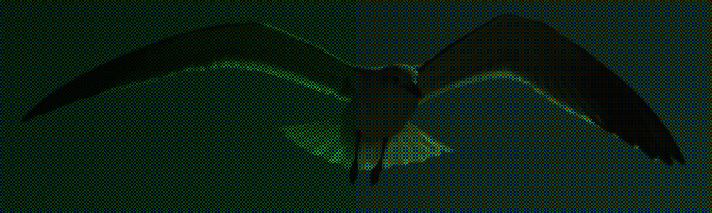

> [!WARNING]
> This document includes images with an un-interpolated bayer pattern, which can
> cause rapid flickering when rendered based on the zoom level and
> interpolation. Zooming in or out may help fix this.

# Processing a Raw Photo

tlmerge is designed for photographers who are familiar with how raw photos work.

Often, people think of "shooting in raw" as an alternative to `.jpg` images that
preserves more detail, especially in the highlights and shadows. As opposed to
`.jpg` images, shooting in raw means more possibilities and higher image quality
when you edit your photos in Lightroom.

This is true, but there's more to it. If you use software like Lightroom to
process your raw photos, and you're not familiar with the details of raw photos
processing, you'll want to read over this document before using tlmerge.

You might think that converting a `.cr3` file (a raw format used by Canon) into
a `.jpg` is as simple as converting a `.jpg` to a `.png`. However, this is not
the case. There are few interpretive decisions you have to make when converting
a raw photos.

Additionally, note that raw photo here doesn't mean a `.raw` file. Rather, it
collectively refers to many image formats from each camera manufacturer that
store raw data from the camera sensor. To quote the
`dcraw` [documentation](https://www.dechifro.org/dcraw/):

> "raw" is an English word, not an acronym or file format. "raw photo" \[is\]
> the same adjective that you would use for "crude oil" or "raw materials".

# Follow Along

This document uses a few external tools to develop raw photos for demonstration
purposes. If you'd like to follow along with images of your own to better
understand the raw development process, you should download and install these
tools:

- [rawpy](https://pypi.org/project/rawpy/), a Python wrapper for:
- [LibRaw](https://www.libraw.org), a community-driven fork of:
- [dcraw](https://www.dechifro.org/dcraw/), a command line tool for developing
  raw photos.
- [Histogrammar](http://guillermoluijk.com/software/histogrammar/index.htm), a
  histogram viewer designed to work well with dcraw.

Below many of the images in this document you'll find an accordian—a
collapsible bit of text beginning with a `▶` symbol—that you can unfurl to see
how the image was developed.

# The Camera Sensor

The first step in understanding raw photo is understanding how the camera
sensor works. As you can probably guess, each "pixel" in an image corresponds
to one very tiny photodetector on the camera sensor.

However, this photodetector on the sensor doesn't see in color. It measures
the amount of light it receives but not whether that light is red, green, or
blue. But each pixel in a `.jpg` image has RGB color: three separate numbers for
the amount of red, green, and blue.

So how does a camera sensor see in color? Most consumer cameras have a very
tiny color filter in front of each pixel, called a Bayer filter. The red filters
block everything except red light, the green filters only allow green light to
get through, and the blue filters only allow blue light. Each photodetector
still measures all incoming light waves, but they're restricted to only see
certain colors of light. The filters are arranged in a grid like this:


The exact color arrangement varies between colors, but it's very common to have
twice as many green pixels as blue or red. This mimics the human eye, which
is more sensitive green light. As a result, only 1/4 of the pixels in your
camera are measuring red light, and
the same for blue.

If we convert the raw file directly to a normal raster format like `.tiff`, it
looks very odd. The following example shows the same image converted with a
standard raw processing method and converted directly to a `.tiff` without
processing.[^1]


<details>
  <summary>(Expand for processing code)</summary>

**(Left) Plain TIFF processing**

```
dcraw -T -w -v beach.nef
```

**(Right) Mosaiced showing Bayer filter**

Here we read the raw values from each pixel and assign them to an RGB value.
For example, a red pixel reading 183 becomes the RGB value `(56, 0, 0)` or
`#B70000`. Also, while RGB values typically range from 0-255 per channel, the
raw values can be much larger (up to 65,535 for a 16-bit image). We normalize
them to a 0-255 range so that the brightest pixel in this image is 255.

```python
import imageio.v3 as iio
import numpy as np
import rawpy

with rawpy.imread('beach.nef') as img:  # open raw Nikon image
    rows, columns = img.raw_image.shape
    mosaiced = np.zeros((rows, columns, 3), dtype=np.uint8)
    max_val = np.max(img.raw_image)  # max pixel value for scaling

    for r in range(rows):
        for c in range(columns):
            val = int(img.raw_image[r, c] / max_val * 255)  # scale to 0-255
            color = img.raw_colors[r, c]  # get pixel's color filter
            mosaiced[r, c, 1 if color == 3 else color] = val  # set color val

    iio.imwrite('beach_mosaic.tiff', mosaiced)
```

---

</details>

There are three things in particular to notice about the raw photo:

### It's green

The extra green photodetectors make the whole image appear very green.
Whatever processing method we use must account for this by increasing the
other colors relative to green.

### The pixels are weird

Looking at the individual pixels in the closeup shows us that each pixel is
strictly some shade of red, green or blue. There aren't any other colors, such
as beige in the sand. This is because each photodetector measures just one of
the three colors (RGB) used in computers.

In the zoomed out version, there pixels start to blend together, so there's
actually some other colors. However, it's very hard to see, since the image is
so green.

### It's dark

As a whole, the image is rather dark. There are a couple of reasons for this.
For one, no gamma correction was applied to the raw photo to brighten it on a
log scale (more on this later). Additionally, computer monitors display color
with three LEDs for each pixel: one red, one green, and one blue. In order to
get the brightest output (solid white), all three LEDs must be maxed. However,
this image only uses one color for each pixel. That means that for every pixel
on the screen, two LEDs aren't on at all, and the image looks dark.

---

In order to process a raw photo so that it looks like the version on the left,
we'll need to fix all these problems. The rest of this document outlines that
process. Additionally, there are some other things we can do in the processing
stage to make the image look even better. We'll cover some of those as well.

There are also some other things to know about how the sensor detects light,
which we'll cover later.

# Demosaicing

As [explained previously](#the-camera-sensor), each pixel (or photodetector)
in the camera sensor only detects one color: red, green, or blue. Once we
develop the image, we want each pixel to have full color data.

To do this, we can make inferences based on nearby pixels. Say you're looking
at a particular red pixel in an image. The photodetector there gave measured 30
for the amount of red light, but it didn't measure green or blue. However,
there are four green pixels adjacent to it, which measure 38, 65, 91, and 61.
If we average these values, we get 63.75. Thus, we can estimate that if the
red pixel were able to measure green light, it would have recorded ~64.


Alternatively, we could try interpolating the mosaiced pixels by combining
them in groups of four. If we average together groups of four pixels, we'll
get a full RGB value.

This works well, but it has a pretty big downside of decreasing the overall
resolution of the image. Since every 2x2 grid gets merged into one pixel, the
image resolution is cut in half. It looks good, but we lose some detail. Here's
an image with half-size interpolated colors on the left and the original
sensor data on the right:


<details>
  <summary>(Expand for processing command)</summary>

The following `dcraw` command was used to generate the interpolated image on
the left:

```
dcraw -T -r 1 1 1 1 -g 1 1 -W -h -v seagull.nef
```

It uses default pixel values with raw white balance (`-r 1 1 1 1`), linear
values without a gamma curve (`-g 1 1`), no auto brightness adjustment (`-W`),
and half-size quick interpolation (`-h`). It saves as a `.tiff` file (`-T`) and
runs in verbose mode to show what it's doing (`-v`, optional).

The image on the right is processed with the same script used earlier.

---

</details>

This process of combining the color values from nearby pixels to remove the
bayer pattern is called [demosaicing](https://en.wikipedia.org/wiki/Demosaicing)
or debayering.

The first example above, averaging nearby pixels to estimate color values, is
a pretty naive estimate. It works okay on solid gradients, such as the sky, but
it's not very good for edges with sharp luminance and/or color changes.

There's no perfect solution to demosaic an image. At the end of the day, there's
color information that the sensor didn't give us, and it's impossible to
perfectly derive that information. Thus, demosaicing is an **underdetermined
problem**.

However, there are many demosaicing algorithms available. Some prioritize
computational speed, while others try to produce clean images in particularly
tricky situations (like high contrast edges and fine details). Based on the
photos you're developing, it may be worth trying out a few algorithms to see
which one works best for you.

The `dcraw` tool provides four algorithms in addition to the half-size averaging
approach shown above:

- Bilinear interpolation. This is high-speed but low-quality. Select it with the
  `-q 0` CLI flag.
- Variable Number of Gradients (VNG) interpolation. Select with `-q 1`.
- Patterned Pixel Grouping (PPG) interpolation. Select with `-q 2`.
- Adaptive Homogeneity-Directed (AHD) interpolation. Select with `-q 3`.

It also includes the `-f` flag to interpolate RGBG as four colors. This treats
the two green values in each 2x2 grid as separate colors, which is specific
to certain camera models.

tlmerge uses rawpy to develop images, which is an interface for LibRaw (itself a
fork of dcraw).

LibRaw provides support for additional demosaicing algorithms:

- AAHD
- AFD
- AHD
- AMAZE
- DCB
- DHT
- LINEAR
- LMMSE
- MODIFIED_AHD
- PPG
- VCD
- VCD_MODIFIED_AHD
- VNG

> [!IMPORTANT]
> Some of these algorithms are included in GPL2– and GPL3-licensed demosaic
> packs. These are not compatible with the MIT license used by rawpy and
> tlmerge, and thus they are not included by default.

### Brightness

You may have noticed that the interpolated image of the seagull above is
considerably brighter than the raw photo. Combining the luminance of all three
colors within each pixel makes the overall image considerably brighter.

# White Balance

So far, our raw photo have looked very green. The bayer filter uses twice as
many green pixels as red or blue, so the total amount of green is somewhat
excessive.

In the interpolated [seagull image](images/demosaic_interpolation.png) above,
there's a bit less green overall, but we can tell from the seagull (which
should be white) that our white balance is off.

I won't explain everything about white balance here, but suffice it to say that
it's more complicated than a one-time correction for every photo on a certain
camera. We need it not only to account for the extra green pixels in the sensor
but also because of the lighting conditions in the photo.

If you've edited photos before in software like Adobe Lightroom, you probably
think about white balance in terms of **temperature** and **tint**. Temperature
adjusts blue/yellow, and tint adjusts green/magenta. While that's a helpful,
user-friendly approach, white balance on a raw photo doesn't actually work that
way.

Remember how the sensor is a bunch of red, green, and blue pixels? We correct
white balance by multiplying each of those colors by some number. Setting the
white balance in tlmerge looks like this:

```yaml
white_balance:
  red: 2.2583
  green_1: 1.0
  blue: 1.6678
  green_2: 1.0
```

Each color channel is assigned its own **multiplier** (also called its
**coefficient**). If the coefficient is `1.0`, it has no effect, as anything
multiplied by 1 is itself.

Note the two different green multipliers. On some cameras, the two greens are
slightly different. Most of the time, however, we can use the same multiplier
(also called the **coefficient**) for both of them.


This is a bit of an oversimplification, but generally speaking, the multipliers
are applied to the pixels of the corresponding color when processing the raw
image.

In the above example, you can see that the large 2.2583x multiplier for the red
channel significantly increased the amount of red in the image. If we apply
that to the full seagull image from earlier, the strong green tint disappears.



The white balanced image (on the right) is closer to the actual colors as a
human sees it. Additionally, our white balance coefficients increased the values
of the red and blue pixels, the image is slightly brighter. However, it still
looks pretty underexposed. Remember that this uses the bayer pattern, so each
pixel only displays one of the three colors. Once we interpolate, adjust for
the sensor's black and white levels, and apply a gamma correction, it'll look
a lot better.

We can also apply these white balance multipliers to the half-size interpolated
image:


<details>
  <summary>(Expand for processing command)</summary>

The following `dcraw` command was used to generate the white-balanced image.
It's the same as the interpolated one earlier but with updated white balance
multipliers.

```
dcraw -T -r 2.2583 1 1.6678 1 -g 1 1 -W -h -v seagull.nef
```

The `-r` flag sets white balance: `-r [red] [green1] [blue] [green2]`.

---

</details>

This looks just about perfect, but we could always make fine adjustments to
the coefficients if necessary.

# Contrast

When you take a picture, each photodetector in the camera's sensor records
a value for the "amount" of light it received. These values are stored in the
raw file.

The range of possible light values varies between cameras. Often, process these
values as unsigned 16-bit integers. However, that doesn't mean a photodetector
could give a reading anywhere from 0 to 65,535 (2<sup>16</sup>-1). In practice,
a
camera might only capture 12-bit (≤4,095) or 14-bit (≤16,383) values, for
example.

## White Level

Let's say your camera captures 12-bit values. Even if you take this into
account, you might be surprised to find that none of the raw pixels ever reach
the theoretical maximum of 4095. You try taking an over-exposed photo of a
bright white light, but the brightest pixels only read 4072.

This phenomenon is caused by the sensor's **white level** (also called its
**saturation**). Because of the physical characteristics of the sensor, the
individual photodetectors become fully saturated once they absorb enough
photons. We've reached the camera's dynamic range: it hit 4072, and now it can't
reliably discern any more detail. Thus, the camera manufacturer capped the
maximum value.

## Black Level

As you might expect, the **black level** (also called **darkness**) is the same,
except for shadows instead of highlights. Even if you cover the lens and take
a picture in a dark room, you never get any pixels below, say, 100.

## Finding the White Level

In order to find black/white levels and address the dynamic range of the sensor,
we can use a photo with both under– and over-exposed regions. A sunset with
visible shadows works great for this purpose.


<details>
  <summary>(Expand for processing command)</summary>

This was processed with default settings and saved as an 8-bit `tiff` using the
`-T` flag. The `-v` flag prints verbose messages.

```
dcraw -T -v sunset.nef
```

It was then resized down to save space.

---

</details>

<p id="raw-unscaled-16bit-photo">
We can start by converting the raw photo directly to a `tiff`: no interpolation,
no white balance correction, no gamma curve, and no white/black level scaling.
Here's what that looks like:
</p>


<details>
  <summary>(Expand for processing command)</summary>

The sunset photo with unscaled pixel values was created with the following
`dcraw` command:

```
dcraw -T -4 -D -v sunset.nef
```

- `-T` to output a `tiff` image.
- `-4` for a 16-bit output with no brightness adjustments (i.e. no auto
  brightness and no gamma curve). It's the same as `-6 -W -g 1 1`.
- `-D` does two things. First, it disables interpolation, yielding a black and
  white image. That's the same as `-d`. Second, it disables light value scaling,
  which include white balance, black level, and saturation adjustments.
  Altogether, it's the same as `-d -r 1 1 1 1 -k 0 -S 65535`.
- `-v` to print verbose messages (optional).

<p id="raw-unscaled-16bit">
This command with more explicit flags yields *exactly* the same result, which
is useful when you're trying to understand how it works:
</p>

```
dcraw -T -6 -W -g 1 1 -d -r 1 1 1 1 -k 0 -S 65535 -v sunset.nef
```

- `-T` for `tiff`.
- `-6` for 16-bit output.
- `-W` to disable auto brightness adjustment.
- `-g 1 1` to disable the gamma curve.
- `-r 1 1 1 1` to disable white balance correction.
- `-k 0` to disable black level adjustments.
- `-S 65535` to disable white level adjustments.
- `-v` for verbose output.

However, neither of these produce the actual image you see above. They produce
16-bit output, which was only used to generate the histogram. The actual image
used in this document is 8-bit, and it was created with this command:

```
dcraw -T -D -W -g 1 1 -v sunset.nef
```

The `-4` flag was substituted with `-W -g 1 1`. It still disables the brightness
adjustments, but the output is no longer 16-bit.

> [!NOTE]
> Strictly speaking, you might want to use `-E` instead of `-D` if you're doing
> this yourself. The `-D` flag doesn't include the thin border of pixels around
> the image that are used to get better interpolation results. If you're using a
> picture with clear bright and dark areas, however, that shouldn't make any
> difference.

---

</details>

Obviously, this looks very dark. Much darker, in fact, than the [supposedly
unprocessed raw photo](#the-camera-sensor) from earlier. That's because in order
to clearly show the RGB bayer pattern with colored pixels, it was necessary to
scale the luminance values of each pixel with a white level in mind. This time,
we're looking at the true, uncolored and unscaled raw data straight out of the
camera.[^2]

We can view this unprocessed data in a histogram using Histogrammar to identify
the white and black levels.


This histogram is plotting the luminance value of each pixel in the image. The
x-axis represents the luminance: solid black on the left, and solid white on the
right. The x-axis represents the number of pixels at a particular luminance.
The blue line shows us the number of pixels at each brightness level.

This full histogram goes from a luminance of 0 to 65,535 to support 16-bit data.
However, we can see that most of the graph is empty. It looks like the camera is
only producing data on the lower end. That makes sense, because the image looks
very dark. Let's zoom in closer on the lower values:


Now we can see what's going on more clearly. This view goes from a luminance
of 0 to 6143. There are two important observations to make from this graph:

1. Most of the values are very dim. This is happening for a few reasons. For
   one, looking at the [original image](images/sunset_postprocessed_small.jpg),
   we can see a lot of pixels in the shadows: the beach, tree branches, and boat
   are all very dark. Second, we haven't applied a log gamma curve to scale the
   values. More on that later.
2. There's a very clear spike in the graph at the higher end. This is the center
   of the sun (and possibly some of the reflections on the water), which we know
   are a little bit overexposed.

If we zoom in on the highlights, we can check that the spike is at 4087. That's
the highest luminance value of any pixel in the image. Histogrammar confirms
this in the stats panel:


```
Dynamic range:
  RGB: 4088 (6% of available), range [0..4087]
```

This tells us that the sensor's white level is 4087. Once each photodetector
reaches 4087, it's fully saturated and can't go any higher.

We know this is the case because of the clear pick in the histogram. The line
is mostly flat, and then all of a sudden a bunch of pixels hit the same exact
number. The sun isn't a perfect circle of *exactly* 4087 luminance all the time,
so we know the sensor must be clipping (i.e. fully saturated at that location).

It looks like the camera is probably capturing 12-bit data, which ranges from 0
to 4,095 (i.e. 2<sup>12</sup> - 1). Additionally, each photodetector can't quite
make it to 4,095: they saturate at the slightly lower 4,087 on this particular
camera.

Let's develop the same image again (still using raw uncolored values), this time
using a white level of 4087. In other words, we'll scale the luminance value of
each pixel with this equation:

```
new_luminance = original_luminance / 4087 * 65535
```

This is for 16-bit output, which has a full 65,535 range. If we want 8-bit
output (0 to 255), we can use a slightly different formula:

```
new_luminance = original_luminance / 4087 * 255
```

Here's the same image developed with our new white level:[^3]


<details>
  <summary>(Expand for processing command)</summary>

This is based on the expanded command from [earlier](#raw-unscaled-16bit), but
with the saturation level set to 4087.

```
dcraw -T -6 -W -g 1 1 -d -r 1 1 1 1 -k 0 -S 4087 -v sunset.nef
```

Just like last time, the 16-bit output was only used for the histogram. The
actual photo you see above is 8-bit, and it was created with the same command
sans the `-6` flag:

```
dcraw -T -W -g 1 1 -d -r 1 1 1 1 -k 0 -S 4087 -v sunset.nef
```

---

</details>


Clearly, this helped a lot. There's much more detail visible in the image, now
that we're processing with the sensor's dynamic range in mind. The histogram
shows luminance values spanning the full image.[^4]

However, you may have noticed that even the darkest shadows in the photo look a
little gray or "washed out". That's because we still need to set the black
level.

### Direct Calculation

If you don't want to go through the process of creating a histogram, it's also
possible to calculate the saturation level directly in the terminal using
dcraw. Take a photo of something bright/shiny (like a sunset), and run the
following command:

```
dcraw -D -4 -c [bright_photo] | pamsumm -max 
```

<details>
  <summary>(Details)</summary>

- `-D` disables luminance scaling (no white balance, black level, or white level
  applied). It also disables interpolation and color information. It's
  equivalent to `-d -r 1 1 1 1 -k 0 -S 65535`.
- `-4` enables 16-bit output (as opposed to 8-bit) and disables auto brightness
  correction and the gamma curve. It's equivalent to `-6 -W -g 1 1`.
- `-c` tells dcraw to write the decoded image to standard output rather than a
  file. By default, dcraw uses `.pgm`, `.ppm`, or `.pam` as the output format.
- We can then pipe the image into `pamsumm`, which computes the max luminance
  value across all pixels.

> [!NOTE]
> If you want to include the border pixels in the sensor that typically excluded
> from processed photos, you can replace `-D` with `-E`. It does all the same
> things without cropping out those border pixels.

---

</details>

Running this command on the sunset photo above confirms our result:

```
the maximum of all samples is 4087
```

## Finding the Black Level

The process of finding the black level is much the same as the white level. We
start with the original histogram of the unscaled sunset data.[^5]


This time, we're interested in the peak on the left, which shows the lower
luminance values. We can zoom in there to show more detail.


Notice that while there is a clear peak at the lower end, it's not as precise
as the white level peak. The lowest luminance of any pixel is 149, but it
doesn't peak until 157. The region highlighted in red spans a 10 luminance
values from the lowest pixel.

This is happening because the sensor's black level works a bit different from
the white level. With the white level, the photodetectors become saturated when
they receive so much light that they can no longer discern slight differences in
light. The sensor caps the values and won't go any higher.

The black level, on the other hand, is caused by heat and electrical noise. When
a photodetector heats up (because the camera is in a warm environment or was
running for a while), it will errantly report more light than it actually
captured. That's why we call a pixel
[hot](https://en.wikipedia.org/wiki/Hot_pixel_(telescopes)) when it's
becomes defective and always shows too bright of a value.

Unlike white level, which is mostly constant, the black level can vary slightly
from pixel to pixel. If one part of the sensor is warmer than another part,
those pixels will have slightly higher luminance values, even in a pitch-black
room with the lens cap completely covered.

Since most of this peak at the low end is the product of sensor noise, there's
not much useful information for us to recover. Thus, we can set the black level
to cut off that noise. If we set the black level to 157 (the highest peak), all
luminance values <157 are automatically corrected to 157:

```
new_luminance = max(157, original_luminance)
```

Remember that all pixels at or below the black level will be solid black
`#000000` in the final processed image. If we set our black level too high,
we'll unnecessarily clip important details in the shadows that we might want
to keep.

While we could probably pick any black level in the highlighted range and be
just fine, it's not obvious which option is the best. Luckily, we have another
option.

### Using a Dark Frame

A common technique for calculating a good black level is to use a dark frame.
That's a picture with no light whatsoever, which *should* come out to solid
black.

Dark frames can be particularly important when capturing timelapses, which
often use a slow shutter speed to increase motion blur. The longer the shutter
stays open, the more thermal noise accumulates on the sensor.

You can capture a dark frame as follows:

1. Put the lens cap on the lens, ensuring no light can enter the sensor. If
   you're using a DSLR with a viewfinder, cover that too.
2. Set your shutter speed and ISO to the same settings you're using to capture
   the timelapse. Make sure to take your dark frames immediately before or after
   the timelapse, so the ambient temperature stays constant as well.
3. Take a picture. You can do it with one, but it's better to take 5 or 10 and
   average the results.

Now, process the raw the photo without any luminance scaling or interpolation,
[just like we did](#raw-unscaled-16bit) for the sunset photo. It'll look solid
black, but the opening it in a histogram shows slight variations in luminance:


As we can see, the pixels in this dark frame range from 148 to 166, with almost
all of them in a narrow peak between 148 and 151. The few near 166 are likely
hot.

To calculate the black level, we can average out all the values in this photo.
If you have dcraw installed, you can do that in one command on Linux:

```
dcraw -D -4 -c [darkframe_photo] | pamsumm -mean
```

<details>
  <summary>(Details)</summary>

Most of this is the same as
[the command for the white level](#direct-calculation). Here, we use
`pamsumm -mean` to compute the average luminance across all pixels. We don't
want to use `-min`, as this doesn't account for variation in sensor noise
across the pixels.

---

</details>

Using our dark frame above, we can compute the black level:

```
the mean of all samples is 149.902391
```

We can round that to 150. This makes sense, since the peak in the histogram
above is around 150. Additionally, dcraw already uses 150 by default for this
camera model, so it's probably a good choice.[^6]

---

Now, let's re-process the sunset image using both our white level of 4087 and
black level of 150.


Seeing the side-by-side versions make it clear just how important it is to set
the black level. Our shadows are truly black `#000000`, and we're making full
use of the camera's dynamic range.

Of course, this also made the image appear darker again. We'll fix that when
we discuss the gamma correction later.

## Color-Dependent White Level

We've discussed possible variations in the black level already, but so far,
we've assumed that the sensor has exactly one white level. Unfortunately, it's
not that simple. It turns out that on some cameras, the white level varies
between colors.

For example, it's common for red and blue to have a higher saturation level than
green. Let's say the colors saturate at these levels:[^7]

```
red: 4080
green: 3450
blue: 4080
```

If we used the method described [above](#finding-the-white-level) for finding
the white level, we'd probably pick 4080. It'd be the highest peak on the
histogram, after all.

However, if we fully processed an image like that, we'd get a strange result.
Here, I've simulated what this would look like in the sunset image if red and
blue saturated at 4080 while green saturated at 3450.


<details>
  <summary>(Expand for processing command)</summary>

This photo was created by artificially clipping the individual color channels
to simulate different saturation levels. Here's a simplified script to do that:

```python
import imageio.v3 as iio
import rawpy

with rawpy.imread('sunset.nef') as img:  # open raw Nikon image
    img_raw = img.raw_image
    img_colors = img.raw_colors
    rows, columns = img_raw.shape

    for r in range(rows):
        for c in range(columns):
            color = img_colors[r, c]
            if color == 0 or color == 2:
                img_raw[r, c] = min(img_raw[r, c], 4080)  # Saturate R/B at 4080
            else:
                img_raw[r, c] = min(img_raw[r, c], 3450)  # Saturate G at 3450

    iio.imwrite('sunset_tint.tiff', img.postprocess(user_sat=4080))
```

The actual image also clipped to a black level of 150 for all channels.

The histogram shown below uses a similar script, except that it doesn't do
any postprocessing. Instead, it outputs a very dark black-and-white image
like the one [here](#raw-unscaled-16bit-photo) by writing the pixel values
directly:

```python
iio.imwrite('sunset_tint.tiff', img_raw)
```

---

</details>

Most of the image looks normal-ish. However, the highlights—the sun and the
light reflecting on the water—have a strange magenta tint.

If we look at a histogram, we can see two peaks in the highlights: one for
green, and the other for red/blue.


Since the green channel has a lower saturation level, it's never able to max-out
the luminance of pixels in the highlights. In the center of the sun, which is
over-exposed, all the channels are clipping. That means green is 3450, and red
and blue are 4080. Once we interpolate everything during the postprocessing,
we get pixels that are about 85% green, 100% red, and 100% blue. That extra red
and blue blend together to make a pale magenta/purple.

Histogrammar also allows you to view a black-and-white image "in color" by
specifying the layout of the bayer filter. If we click the `RAW -> RGB` button
and select the `RGGB` bayer pattern, it draws a separate line for each color:


This confirms that the green pixels saturate at a lower value than the red and
blue pixels.

Now, how do you fix this problem? You simply need to develop using the lowest
saturation level across all three colors. That effectively lowers the saturation
of the red and blue channels to 3450, the same as green. If any red or blue
pixels have a value greater than 3450, that gets replaced with 3450. Once you
preprocess the photo, all the highlights that clipped will be 100% for red,
green, and blue.

Unfortunately, this means that all the luminance data in the red and blue
channels above 3450 is lost. However, the simulated example here greatly
exaggerated the difference in saturation levels beyond what you'd typically
find in a real sensor. In other words, you aren't losing too much data.

---

[^1]: Technically, there's some processing going on here to scale the
pixel brightness and directly assign a color to each pixel. See the code below
the image for details.

[^2]: Ok, it's not *exactly* the raw data. We're treating it as 16-bit data even
though this particular camera only outputs in 12-bit—but that's so it works
correctly with the histogram. The actual image in this document is also
compressed down to 8-bit in order to save some space in the repository. And this
photo is resized to a third of its original size and cropped from there—not to
mention discarding the masked pixels in the thin border around the sensor.
But that's mostly beside the point. The grayscale pixels do accurately represent
the colorless data from the camera's sensor, and the under-exposure demonstrates
the need for a white level.

[^3]: The photo shown here is scaled down to 8-bit and resized to a third of its
original size, but the histogram uses a full size 16-bit version.

[^4]: Strictly speaking, there are missing values on the lower end, as we
haven't accounted for the black level, yet. We'll get to that. Also, there are
many small gaps due to how 0–4087 data is scaled to a 0–65535 range, but that's
unavoidable and not something to worry about.

[^5]: You might think that we'd want to start with the histogram we just got
using the new white level. However, in the process of scaling the luminance for
the white level, we changed the location of the peak on the lower end of the
graph that marks the black level.

[^6]: Note that dcraw might have errors, however. It's always a good idea to
double-check your black and white levels for each new camera model.
Additionally, as emphasized already, the black level can be influenced by other
factors including temperature and shutter speed. In this case, the dark frame
and sunset photo were not taken at the same time or place or with the same
settings, so we could probably do better. The true black level may be higher.
This is just an example, after all.

[^7]: That's a very significant gap, but it's a useful hypothetical for making
this point, as the magenta tint is very clear.
